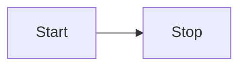

# Editor

Source: Obsidian developer docs (obsidian-developer-docs repo).

## Contents

- [Editor](#editor)
- [Editor extensions](#editor-extensions)
- [Decorations](#decorations)
- [Markdown post processing](#markdown-post-processing)
- [Communicating with editor extensions](#communicating-with-editor-extensions)
- [State fields](#state-fields)
- [State management](#state-management)
- [View plugins](#view-plugins)
- [Viewport](#viewport)

## Editor

The [[Reference/TypeScript API/Editor|Editor]] class exposes operations for reading and manipulating an active Markdown document in edit mode.

If you want to access the editor in a command, use the [[Commands#Editor commands|editorCallback]].

If you want to use the editor elsewhere, you can access it from the active view:

```ts
const view = this.app.workspace.getActiveViewOfType(MarkdownView);

// Make sure the user is editing a Markdown file.
if (view) {
	const cursor = view.editor.getCursor();

	// ...
}
```

> [!note]
> Obsidian uses [CodeMirror](https://codemirror.net/) (CM) as the underlying text editor, and exposes the CodeMirror editor as part of the API. `Editor` serves as an abstraction to bridge features between CM6 and CM5 (legacy editor, only available on desktop). By using `Editor` instead of directly accessing the CodeMirror instance, you ensure that your plugin works on both platforms.

## Insert text at cursor position

The [[replaceRange|replaceRange()]] method replaces the text between two cursor positions. If you only give it one position, it inserts the new text between that position and the next.

The following command inserts today's date at the cursor position:

```ts
import { Editor, moment, Plugin } from 'obsidian';

export default class ExamplePlugin extends Plugin {
  async onload() {
    this.addCommand({
      id: 'insert-todays-date',
      name: 'Insert today\'s date',
      editorCallback: (editor: Editor) => {
        editor.replaceRange(
          moment().format('YYYY-MM-DD'),
          editor.getCursor()
        );
      },
    });
  }
}
```

![[editor-todays-date.gif]]

## Replace current selection

If you want to modify the selected text, use [[replaceSelection|replaceSelection()]] to replace the current selection with a new text.

The following command reads the current selection and converts it to uppercase:

```ts
import { Editor, Plugin } from 'obsidian';

export default class ExamplePlugin extends Plugin {
  async onload() {
    this.addCommand({
      id: 'convert-to-uppercase',
      name: 'Convert to uppercase',
      editorCallback: (editor: Editor) => {
        const selection = editor.getSelection();
        editor.replaceSelection(selection.toUpperCase());
      },
    });
  }
}
```

![[editor-uppercase.gif]]

## Editor extensions

---
aliases: editor extension
---

Editor extensions let you customize the experience of editing notes in Obsidian. This page explains what editor extensions are, and when to use them.

Obsidian uses CodeMirror 6 (CM6) to power the Markdown editor. Just like Obsidian, CM6 has plugins of its own, called _extensions_. In other words, an Obsidian _editor extension_ is the same thing as a _CodeMirror 6 extension_.

The API for building editor extensions is a bit unconventional and requires that you have a basic understanding of its architecture before you get started. This section aims to give you enough context and examples for you to get started. If you want to learn more about building editor extensions, refer to the [CodeMirror 6 documentation](https://codemirror.net/docs/).

## Do I need an editor extension?

Building editor extensions can be challenging, so before you start building one, consider whether you really need it.

- If you want to change how to convert Markdown to HTML in the Reading view, consider building a [[Markdown post processing|Markdown post processor]].
- If you want to change how the document looks and feels in Live Preview, you need to build an editor extension.

## Registering editor extensions

CodeMirror 6 (CM6) is a powerful engine for editing code using web technologies. At its core, the editor itself has a minimal set of features. Any features you'd expect from a modern editor are available as _extensions_ that you can pick and choose. While Obsidian comes with many of these extensions out-of-the-box, you can also register your own.

To register an editor extension, use [[registerEditorExtension|registerEditorExtension()]] in the `onload` method of your Obsidian plugin:

```ts
onload() {
  this.registerEditorExtension([examplePlugin, exampleField]);
}
```

While CM6 supports several types of extensions, two of the most common ones are [[View plugins]] and [[State fields]].
<DocCardList items={useCurrentSidebarCategory().items}/>

## Decorations

Decorations let you control how to draw or style content in [[Editor extensions|editor extensions]]. If you intend to change the look and feel by adding, replacing, or styling elements in the editor, you most likely need to use decorations.

By the end of this page, you'll be able to:

- Understand how to use decorations to change the editor appearance.
- Understand the difference between providing decoration using state fields and view plugins.

> [!note]
> This page aims to distill the official CodeMirror 6 documentation for Obsidian plugin developers. For more detailed information on state fields, refer to [Decorating the Document](https://codemirror.net/docs/guide/#decorating-the-document).

## Prerequisites

- Basic understanding of [[State fields]].
- Basic understanding of [[View plugins]].

## Overview

Without decorations, the document would render as plain text. Not very interesting at all. Using decorations, you can change how to display the document, for example by highlighting text or adding custom HTML elements.

You can use the following types of decorations:

- [Mark decorations](https://codemirror.net/docs/ref/#view.Decoration%5Emark) style existing elements.
- [Widget decorations](https://codemirror.net/docs/ref/#view.Decoration%5Ewidget) insert elements in the document.
- [Replace decorations](https://codemirror.net/docs/ref/#view.Decoration%5Ereplace) hide or replace part of the document with another element.
- [Line decorations](https://codemirror.net/docs/ref/#view.Decoration%5Eline) add styling to the lines, rather than the document itself.

To use decorations, you need to create them inside an editor extension and have the extension _provide_ them to the editor. You can provide decorations to the editor in two ways, either _directly_ using [[State fields|state fields]] or _indirectly_ using [[View plugins|view plugins]].

## Should I use a view plugin or a state field?

Both view plugins and state fields can provide decorations to the editor, but they have some differences.

- Use a view plugin if you can determine the decoration based on what's inside the [[Viewport]].
- Use a state field if you need to manage decorations outside of the viewport.
- Use a state field if you want to make changes that could change the content of the viewport, for example by adding line breaks.

If you can implement your extension using either approach, then the view plugin generally results in better performance. For example, imagine that you want to implement an editor extension that checks the spelling of a document.

One way would be to pass the entire document to an external spell checker which then returns a list of spelling errors. In this case, you'd need to map each error to a decoration and use a state field to manage decorations regardless of what's in the viewport at the moment.

Another way would be to only spellcheck what's visible in the viewport. The extension would need to continuously run a spell check as the user scrolls through the document, but you'd be able to spell check documents with millions of lines of text.


## Providing decorations

Imagine that you want to build an editor extension that replaces the bullet list item with an emoji. You can accomplish this with either a view plugin or a state field, with some differences.  In this section, you'll see how to implement it with both types of extensions.

Both implementations share the same core logic:

1. Use [syntaxTree](https://codemirror.net/docs/ref/#language.syntaxTree) to find list items.
2. For every list item, replace leading hyphens, `-`, with a _widget_.

### Widgets

Widgets are custom HTML elements that you can add to the editor. You can either insert a widget at a specific position in the document, or replace a piece of content with a widget.

The following example defines a widget that returns an HTML element, `<span>👉</span>`. You'll use this widget later on.

```ts
import { EditorView, WidgetType } from '@codemirror/view';

export class EmojiWidget extends WidgetType {
  toDOM(view: EditorView): HTMLElement {
    const div = document.createElement('span');

    div.innerText = '👉';

    return div;
  }
}
```

To replace a range of content in your document with the emoji widget, use the [replace decoration](https://codemirror.net/docs/ref/#view.Decoration%5Ereplace).

```ts
const decoration = Decoration.replace({
  widget: new EmojiWidget()
});
```

### State fields

To provide decorations from a state field:

1. [[State fields#Defining a state field|Define a state field]] with a `DecorationSet` type.
2. Add the `provide` property to the state field.

   ```ts
   provide(field: StateField<DecorationSet>): Extension {
     return EditorView.decorations.from(field);
   },
   ```

```ts
import { syntaxTree } from '@codemirror/language';
import {
  Extension,
  RangeSetBuilder,
  StateField,
  Transaction,
} from '@codemirror/state';
import {
  Decoration,
  DecorationSet,
  EditorView,
  WidgetType,
} from '@codemirror/view';
import { EmojiWidget } from 'emoji';

export const emojiListField = StateField.define<DecorationSet>({
  create(state): DecorationSet {
    return Decoration.none;
  },
  update(oldState: DecorationSet, transaction: Transaction): DecorationSet {
    const builder = new RangeSetBuilder<Decoration>();

    syntaxTree(transaction.state).iterate({
      enter(node) {
        if (node.type.name.startsWith('list')) {
          // Position of the '-' or the '*'.
          const listCharFrom = node.from - 2;

          builder.add(
            listCharFrom,
            listCharFrom + 1,
            Decoration.replace({
              widget: new EmojiWidget(),
            })
          );
        }
      },
    });

    return builder.finish();
  },
  provide(field: StateField<DecorationSet>): Extension {
    return EditorView.decorations.from(field);
  },
});
```

### View plugins

To manage your decorations using a view plugin:

1. [[View plugins#Creating a view plugin|Create a view plugin]].
2. Add a `DecorationSet` member property to your plugin.
3. Initialize the decorations in the `constructor()`.
4. Rebuild decorations in `update()`.

Not all updates are reasons to rebuild your decorations. The following example only rebuilds decorations whenever the underlying document or the viewport changes.

```ts
import { syntaxTree } from '@codemirror/language';
import { RangeSetBuilder } from '@codemirror/state';
import {
  Decoration,
  DecorationSet,
  EditorView,
  PluginSpec,
  PluginValue,
  ViewPlugin,
  ViewUpdate,
  WidgetType,
} from '@codemirror/view';
import { EmojiWidget } from 'emoji';

class EmojiListPlugin implements PluginValue {
  decorations: DecorationSet;

  constructor(view: EditorView) {
    this.decorations = this.buildDecorations(view);
  }

  update(update: ViewUpdate) {
    if (update.docChanged || update.viewportChanged) {
      this.decorations = this.buildDecorations(update.view);
    }
  }

  destroy() {}

  buildDecorations(view: EditorView): DecorationSet {
    const builder = new RangeSetBuilder<Decoration>();

    for (let { from, to } of view.visibleRanges) {
      syntaxTree(view.state).iterate({
        from,
        to,
        enter(node) {
          if (node.type.name.startsWith('list')) {
            // Position of the '-' or the '*'.
            const listCharFrom = node.from - 2;

            builder.add(
              listCharFrom,
              listCharFrom + 1,
              Decoration.replace({
                widget: new EmojiWidget(),
              })
            );
          }
        },
      });
    }

    return builder.finish();
  }
}

const pluginSpec: PluginSpec<EmojiListPlugin> = {
  decorations: (value: EmojiListPlugin) => value.decorations,
};

export const emojiListPlugin = ViewPlugin.fromClass(
  EmojiListPlugin,
  pluginSpec
);
```

`buildDecorations()` is a helper method that builds a complete set of decorations based on the editor view.

Notice the second argument to the `ViewPlugin.fromClass()` function. The `decorations` property in the `PluginSpec` specifies how the view plugin provides the decorations to the editor.

Since the view plugin knows what's visible to the user, you can use `view.visibleRanges` to limit what parts of the syntax tree to visit.

## Markdown post processing

If you want to change how a Markdown document is rendered in Reading view, you can add your own _Markdown post processor_. As indicated by the name, the post processor runs _after_ the Markdown has been processed into HTML. It lets you add, remove, or replace [[HTML elements]] to the rendered document.

The following example looks for any code block that contains a text between two colons, `:`, and replaces it with an appropriate emoji:

```ts
import { Plugin } from 'obsidian';

const ALL_EMOJIS: Record<string, string> = {
  ':+1:': '👍',
  ':sunglasses:': '😎',
  ':smile:': '😄',
};

export default class ExamplePlugin extends Plugin {
  async onload() {
    this.registerMarkdownPostProcessor((element, context) => {
      const codeblocks = element.findAll('code');

      for (let codeblock of codeblocks) {
        const text = codeblock.innerText.trim();
        if (text[0] === ':' && text[text.length - 1] === ':') {
          const emojiEl = codeblock.createSpan({
            text: ALL_EMOJIS[text] ?? text,
          });
          codeblock.replaceWith(emojiEl);
        }
      }
    });
  }
}
```

## Post-process Markdown code blocks

Did you know that you can create [Mermaid](https://mermaid-js.github.io/) diagrams in Obsidian by creating a `mermaid` code block with a text definition like this one?:

````md

````

If you change to Preview mode, the text in the code block becomes the following diagram:


If you want to add your own custom code blocks like the Mermaid one, you can use [[registerMarkdownCodeBlockProcessor|registerMarkdownCodeBlockProcessor()]]. The following example renders a code block with CSV data, as a table:

```ts
import { Plugin } from 'obsidian';

export default class ExamplePlugin extends Plugin {
  async onload() {
    this.registerMarkdownCodeBlockProcessor('csv', (source, el, ctx) => {
      const rows = source.split('\n').filter((row) => row.length > 0);

      const table = el.createEl('table');
      const body = table.createEl('tbody');

      for (let i = 0; i < rows.length; i++) {
        const cols = rows[i].split(',');

        const row = body.createEl('tr');

        for (let j = 0; j < cols.length; j++) {
          row.createEl('td', { text: cols[j] });
        }
      }
    });
  }
}
```

## Communicating with editor extensions

Once you've built your editor extension, you might want to communicate with it from outside the editor. For example, through a [[Commands|command]], or a [[Ribbon actions|ribbon action]].

You can access the CodeMirror 6 editor from a [[MarkdownView|MarkdownView]]. However, since the Obsidian API doesn't actually expose the editor, you need to tell TypeScript to trust that it's there, using `@ts-expect-error`.

```ts
import { EditorView } from '@codemirror/view';

// @ts-expect-error, not typed
const editorView = view.editor.cm as EditorView;
```

## View plugin

You can access the [[View plugins|view plugin]] instance from the `EditorView.plugin()` method.

```ts
this.addCommand({
	id: 'example-editor-command',
	name: 'Example editor command',
	editorCallback: (editor, view) => {
		// @ts-expect-error, not typed
		const editorView = view.editor.cm as EditorView;

		const plugin = editorView.plugin(examplePlugin);

		if (plugin) {
			plugin.addPointerToSelection(editorView);
		}
	},
});
```

## State field

You can dispatch changes and [[State fields#Dispatching state effects|dispatch state effects]] directly on the editor view.

```ts
this.addCommand({
	id: 'example-editor-command',
	name: 'Example editor command',
	editorCallback: (editor, view) => {
		// @ts-expect-error, not typed
		const editorView = view.editor.cm as EditorView;

		editorView.dispatch({
			effects: [
				// ...
			],
		});
	},
});
```

## State fields

A state field is an [[Editor extensions|editor extension]] that lets you manage custom editor state. This page walks you through building a state field by implementing a calculator extension.

The calculator should be able to add and subtract a number from the current state, and to reset the state when you want to start over.

By the end of this page, you'll understand the basic concepts of building a state field.

> [!note]
> This page aims to distill the official CodeMirror 6 documentation for Obsidian plugin developers. For more detailed information on state fields, refer to [State Fields](https://codemirror.net/docs/guide/#state-fields).

## Prerequisites

- Basic understanding of [[State management]].

## Defining state effects

State effects describe the state change you'd like to make. You may think of them as methods on a class.

In the calculator example, you'd define a state effect for each of the calculator operations:

```ts
const addEffect = StateEffect.define<number>();
const subtractEffect = StateEffect.define<number>();
const resetEffect = StateEffect.define();
```

The type between the angle brackets, `<>`, defines the input type for the effect. For example, the number you want to add or subtract. The reset effect doesn't need any input, so you can leave it out.

## Defining a state field

Contrary to what one might think, state fields don't actually _store_ state. They _manage_ it. State fields take the current state, applies any state effects, and returns the new state.

The state field contains the calculator logic to apply the mathematical operations depending on the effects in a transaction. Since a transaction can contain multiple effects, for example two additions, the state field needs to apply them all one after another.

```ts
export const calculatorField = StateField.define<number>({
  create(state: EditorState): number {
    return 0;
  },
  update(oldState: number, transaction: Transaction): number {
    let newState = oldState;

    for (let effect of transaction.effects) {
      if (effect.is(addEffect)) {
        newState += effect.value;
      } else if (effect.is(subtractEffect)) {
        newState -= effect.value;
      } else if (effect.is(resetEffect)) {
        newState = 0;
      }
    }

    return newState;
  },
});
```

- `create` returns the value the calculator starts with.
- `update` contains the logic for applying the effects.
- `effect.is()` lets you check the type of the effect before you apply it.

## Dispatching state effects

To apply a state effect to a state field, you need to dispatch it to the editor view as part of a transaction.

```ts
view.dispatch({
  effects: [addEffect.of(num)],
});
```

You can even define a set of helper functions that provide a more familiar API:

```ts
export function add(view: EditorView, num: number) {
  view.dispatch({
    effects: [addEffect.of(num)],
  });
}

export function subtract(view: EditorView, num: number) {
  view.dispatch({
    effects: [subtractEffect.of(num)],
  });
}

export function reset(view: EditorView) {
  view.dispatch({
    effects: [resetEffect.of(null)],
  });
}
```

## Next steps

Provide [[Decorations]] from your state fields to change how to display the document.

## State management

This page aims to give an introduction to state management for [[Editor extensions|editor extensions]].

> [!note]
> This page aims to distill the official CodeMirror 6 documentation for Obsidian plugin developers. For more detailed information on state management, refer to [State and Updates](https://codemirror.net/docs/guide/#state-and-updates).

## State changes

In most applications, you would update state by assigning a new value to a property or variable. As a consequence, the old value is lost forever.

```ts
let note = '';
note = 'Heading'
note = '# Heading'
note = '## Heading' // How to undo this?
```

To support features like undoing and redoing changes to a user's workspace, applications like Obsidian instead keep a history of all changes that have been made. To undo a change, you can then go back to a point in time before the change was made.

|   | State      |
|---|------------|
| 0 |            |
| 1 | Heading    |
| 2 | # Heading  |
| 3 | ## Heading |

In TypeScript, you'd then end up with something like this:

```ts
const changes: ChangeSpec[] = [];

changes.push({ from: 0, insert: 'Heading' });
changes.push({ from: 0, insert: '# ' });
changes.push({ from: 0, insert: '#' });
```

## Transactions

Imagine a feature where you select some text and press the double quote, `"` to surround the selection with quotes on both sides. One way to implement the feature would be to:

1. Insert `"` at the start of the selection.
2. Insert `"` at the end of the selection.

Notice that the implementation consists of _two_ state changes. If you added these to the undo history, the user would need to undo _twice_, once for each double quote. To avoid this, what if you could group these changes so that they appear as one?

For editor extensions, a group of state changes that happen together is called a _transaction_.

If you combine what you've learned so far—and if you allow transactions that contain only a single state change—then you can consider state as a _history of transactions_.

Bringing it all together to implement the surround feature from before in an editor extension, here's how you'd add, or _dispatch_, a transaction to the editor view:

```ts
view.dispatch({
  changes: [
    { from: selectionStart, insert: `"` },
    { from: selectionEnd, insert: `"` }
  ]
});
```

## Next steps

On this page, you've learned about modeling state as a series of state changes, and how to group them into transactions.

To learn how to manage custom state in your editor, refer to [[State fields]].

## View plugins

A view plugin is an [[Editor extensions|editor extension]] that gives you access to the editor [[Viewport]].

> [!note]
> This page aims to distill the official CodeMirror 6 documentation for Obsidian plugin developers. For more information on state management, refer to [Affecting the View](https://codemirror.net/docs/guide/#affecting-the-view).

## Prerequisites

- Basic understanding of the [[Viewport]].

## Creating a view plugin

View plugins are editor extensions that run _after_ the viewport has been recomputed. While this means that they can access the viewport, it also means that a view plugin can't make any changes that would impact the viewport. For example, by inserting blocks or line breaks into the document.

> [!tip]
> If you want to make changes that impact the vertical layout of the editor, by for example inserting blocks and line breaks, you need to use a [[State fields|state field]].

To create a view plugin, create a class that implements [PluginValue](https://codemirror.net/docs/ref/#view.PluginValue) and pass it to the [ViewPlugin.fromClass()](https://codemirror.net/docs/ref/#view.ViewPlugin^fromClass) function.

```ts
import {
  ViewUpdate,
  PluginValue,
  EditorView,
  ViewPlugin,
} from '@codemirror/view';

class ExamplePlugin implements PluginValue {
  constructor(view: EditorView) {
    // ...
  }

  update(update: ViewUpdate) {
    // ...
  }

  destroy() {
    // ...
  }
}

export const examplePlugin = ViewPlugin.fromClass(ExamplePlugin);
```

The three methods of the view plugin control its lifecycle:

- `constructor()` initializes the plugin.
- `update()` updates your plugin when something has changed, for example when the user entered or selected some text.
- `destroy()` cleans up after the plugin.

While the view plugin in the example works, it doesn't do much. If you want to better understand what causes the plugin to update, you can add a `console.log(update);` line to the `update()` method to print all updates to the console.

## Next steps

Provide [[Decorations]] from your view plugin to change how to display the document.

## Viewport

The Obsidian editor supports [huge documents](https://codemirror.net/examples/million/) with millions of lines. One of the reasons why this is possible, is because the editor only renders what's visible (and a little bit more).

Imagine that you want to edit a document that is too big to fit on your monitor. The Obsidian editor creates a "window" that moves across the document, only rendering the content within the window (and ignoring what's outside). This window is known as the editor's _viewport_.


Whenever the user scrolls through the document, or when the document itself changes, the viewport becomes out-of-date and needs to be recomputed.

If you want to build an editor extension that depends on the viewport, refer to [[View plugins]].

> [!note]
> This page aims to distill the official CodeMirror 6 documentation for Obsidian plugin developers. For more information on state management, refer to [Viewport](https://codemirror.net/docs/guide/#viewport).
