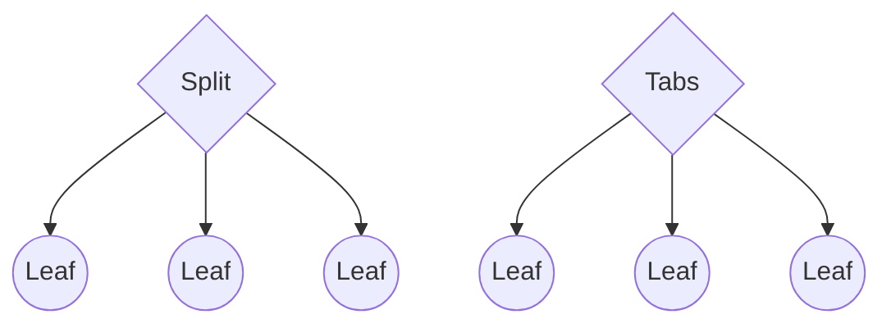
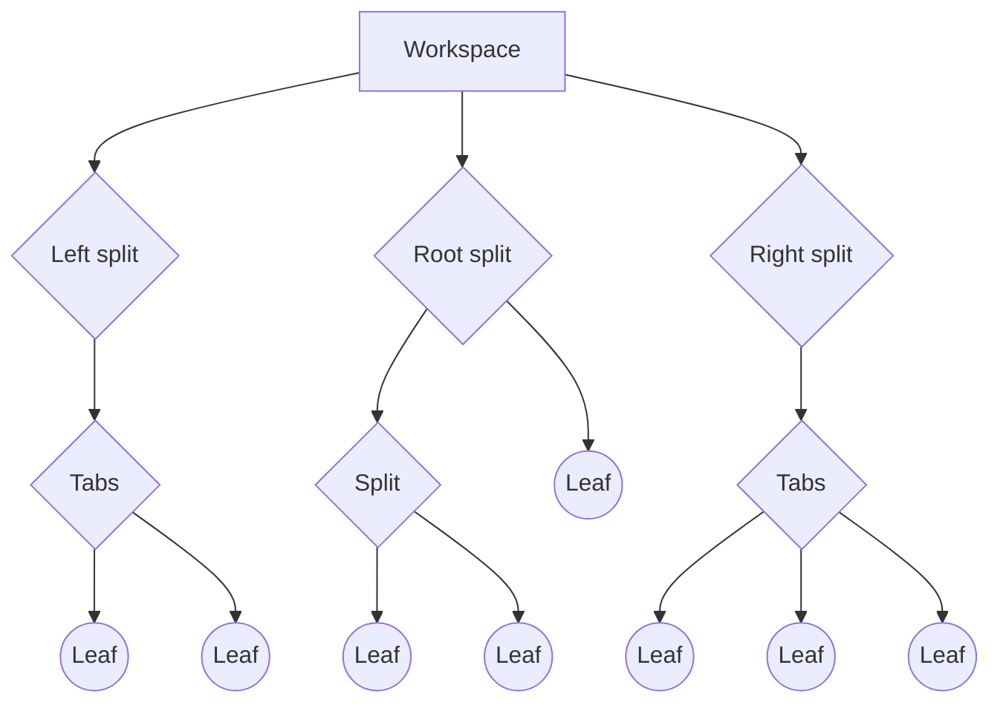
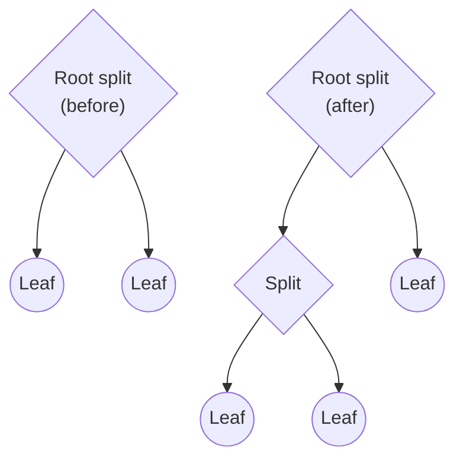
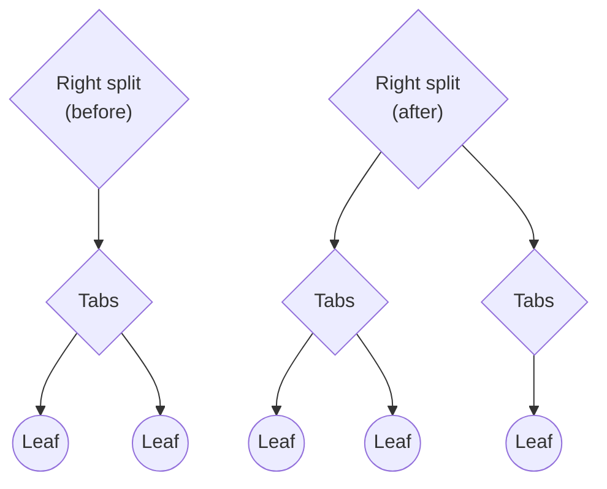

# User Interface

Source: Obsidian developer docs (obsidian-developer-docs repo).

## Contents

- [About user interface](#about-user-interface)
- [Commands](#commands)
- [Context menus](#context-menus)
- [HTML elements](#html-elements)
- [Icons](#icons)
- [Modals](#modals)
- [Ribbon actions](#ribbon-actions)
- [Right-to-left](#right-to-left)
- [Settings](#settings)
- [Status bar](#status-bar)
- [Views](#views)
- [Workspace](#workspace)

## About user interface

This page gives you an overview of how to add or change the Obsidian user interface.

You can see some of the user interface components when you first open Obsidian.

- [[Ribbon actions]]
- [[Views]]
- [[Plugins/User interface/Status bar|Status bar]]

To modify the editor, refer to [[Editor]] and [[Editor extensions]].


## Commands

Commands are actions that the user can invoke from the [Command Palette](https://help.obsidian.md/Plugins/Command+palette) or by using a hot key.

![[command.png]]

To register a new command for your plugin, call the [[addCommand|addCommand()]] method inside the `onload()` method:

```ts
import { Plugin } from 'obsidian';

export default class ExamplePlugin extends Plugin {
  async onload() {
    this.addCommand({
      id: 'print-greeting-to-console',
      name: 'Print greeting to console',
      callback: () => {
        console.log('Hey, you!');
      },
    });
  }
}
```

## Conditional commands

If your command is only able to run under certain conditions, consider using [[checkCallback|checkCallback()]] instead.

The `checkCallback` runs twice. First, to perform a preliminary check to determine whether the command can run. Second, to perform the action.

Since time may pass between the two runs, you need to perform the check during both calls.

To determine whether the callback should perform a preliminary check or an action, a `checking` argument is passed to the callback.

- If `checking` is set to `true`, perform a preliminary check.
- If `checking` is set to `false`, perform an action.

The command in the following example depends on a required value. In both runs, the callback checks that the value is present but only performs the action if `checking` is `false`.

```ts
this.addCommand({
  id: 'example-command',
  name: 'Example command',
  // highlight-next-line
  checkCallback: (checking: boolean) => {
    const value = getRequiredValue();

    if (value) {
      if (!checking) {
        doCommand(value);
      }

      return true
    }

    return false;
  },
});
```

## Editor commands

If your command needs access to the editor, you can also use the [[editorCallback|editorCallback()]], which provides the active editor and its view as arguments.

```ts
this.addCommand({
  id: 'example-command',
  name: 'Example command',
  editorCallback: (editor: Editor, view: MarkdownView) => {
    const sel = editor.getSelection()

    console.log(`You have selected: ${sel}`);
  },
}
```

> [!note]
> Editor commands only appear in the Command Palette when there's an active editor available.

If the editor callback can only run under certain conditions, consider using [[editorCheckCallback|editorCheckCallback()]] instead. For more information, refer to [[#Conditional commands]].

```ts
this.addCommand({
  id: 'example-command',
  name: 'Example command',
  editorCheckCallback: (checking: boolean, editor: Editor, view: MarkdownView) => {
    const value = getRequiredValue();

    if (value) {
      if (!checking) {
        doCommand(value);
      }

      return true
    }

    return false;
  },
});
```

## Hot keys

The user can run commands using a keyboard shortcut, or _hot key_. While they can configure this themselves, you can also provide a default hot key.

> [!warning]
> Avoid setting default hot keys for plugins that you intend for others to use. Hot keys are highly likely to conflict with those defined by other plugins or by the user themselves.

In this example, the user can run the command by pressing and holding Ctrl (or Cmd on Mac) and Shift together, and then pressing the letter `a` on their keyboard.

```ts
this.addCommand({
  id: 'example-command',
  name: 'Example command',
  hotkeys: [{ modifiers: ['Mod', 'Shift'], key: 'a' }],
  callback: () => {
    console.log('Hey, you!');
  },
});
```

> [!note]
> The Mod key is a special modifier key that becomes Ctrl on Windows and Linux, and Cmd on macOS.

## Context menus

If you want to open up a context menu, use [[Menu|Menu]]:

```ts
import { Menu, Notice, Plugin } from 'obsidian';

export default class ExamplePlugin extends Plugin {
  async onload() {
    this.addRibbonIcon('dice', 'Open menu', (event) => {
      const menu = new Menu();

      menu.addItem((item) =>
        item
          .setTitle('Copy')
          .setIcon('documents')
          .onClick(() => {
            new Notice('Copied');
          })
      );

      menu.addItem((item) =>
        item
          .setTitle('Paste')
          .setIcon('paste')
          .onClick(() => {
            new Notice('Pasted');
          })
      );

      menu.showAtMouseEvent(event);
    });
  }
}
```

[[showAtMouseEvent|showAtMouseEvent()]] opens the menu where you clicked with the mouse.

> [!tip]
> If you need more control of where the menu appears, you can use `menu.showAtPosition({ x: 20, y: 20 })` to open the menu at a position relative to the top-left corner of the Obsidian window.

For more information on what icons you can use, refer to [[Plugins/User interface/Icons|Icons]].

You can also add an item to the file menu, or the editor menu, by subscribing to the `file-menu` and `editor-menu` workspace events:

![[context-menu-positions.png]]

```ts
import { Notice, Plugin } from 'obsidian';

export default class ExamplePlugin extends Plugin {
  async onload() {
    this.registerEvent(
      this.app.workspace.on('file-menu', (menu, file) => {
        menu.addItem((item) => {
          item
            .setTitle('Print file path 👈')
            .setIcon('document')
            .onClick(async () => {
              new Notice(file.path);
            });
        });
      })
    );

    this.registerEvent(
      this.app.workspace.on("editor-menu", (menu, editor, view) => {
        menu.addItem((item) => {
          item
            .setTitle('Print file path 👈')
            .setIcon('document')
            .onClick(async () => {
              new Notice(view.file.path);
            });
        });
      })
    );
  }
}
```

For more information on handling events, refer to [[Events]].

## HTML elements

Several components in the Obsidian API, such as the [[Settings]], expose _container elements_:

```ts
import { App, PluginSettingTab } from 'obsidian';

class ExampleSettingTab extends PluginSettingTab {
  plugin: ExamplePlugin;

  constructor(app: App, plugin: ExamplePlugin) {
    super(app, plugin);
    this.plugin = plugin;
  }

  display(): void {
    // highlight-next-line
    let { containerEl } = this;

    // ...
  }
}
```

Container elements are `HTMLElement` objects that make it possible to create custom interfaces within Obsidian.

## Create HTML elements using `createEl()`

Every `HTMLElement`, including the container element, exposes a `createEl()` method that creates an `HTMLElement` under the original element.

For example, here's how you can add an `<h1>` heading element inside the container element:

```ts
containerEl.createEl('h1', { text: 'Heading 1' });
```

`createEl()` returns a reference to the new element:

```ts
const book = containerEl.createEl('div');
book.createEl('div', { text: 'How to Take Smart Notes' });
book.createEl('small', { text: 'Sönke Ahrens' });
```

## Style your elements

You can add custom CSS styles to your plugin by adding a `styles.css` file in the plugin root directory. To add some styles for the previous book example:

```css title="styles.css"
.book {
  border: 1px solid var(--background-modifier-border);
  padding: 10px;
}

.book__title {
  font-weight: 600;
}

.book__author {
  color: var(--text-muted);
}
```

> [!tip]
> `--background-modifier-border` and `--text-muted` are [CSS variables](https://developer.mozilla.org/en-US/docs/Web/CSS/Using_CSS_custom_properties) that are defined and used by Obsidian itself. If you use these variables for your styles, your plugin will look great even if the user has a different theme! 🌈

To make the HTML elements use the styles, set the `cls` property for the HTML element:

```ts
const book = containerEl.createEl('div', { cls: 'book' });
book.createEl('div', { text: 'How to Take Smart Notes', cls: 'book__title' });
book.createEl('small', { text: 'Sönke Ahrens', cls: 'book__author' });
```

Now it looks much better! 🎉

![[styles.png]]

### Conditional styles

Use the `toggleClass` method if you want to change the style of an element based on the user's settings or other values:

```ts
element.toggleClass('danger', status === 'error');
```

## Icons

Several of the UI components in the Obsidian API let you configure an accompanying icon. You can choose from one of the built-in icons, or you can add your own.

## Browse available icons

Browse to [lucide.dev](https://lucide.dev/) to see all available icons and their corresponding names.

**Please note:** Only icons up to v0.446.0 are supported at this time.

## Use icons

If you'd like to use icons in your custom interfaces, use the [[setIcon|setIcon()]] utility function to add an icon to an [[HTML elements|HTML element]]. The following example adds an icon to the status bar:

```ts
import { Plugin, setIcon } from 'obsidian';

export default class ExamplePlugin extends Plugin {
  async onload() {
    const item = this.addStatusBarItem();
    setIcon(item, 'info');
  }
}
```

To change the size of an icon, set the `--icon-size` [[Reference/CSS variables/Foundations/Icons|CSS variable]] on the element containing the icon using preset sizes:

```css
div {
  --icon-size: var(--icon-size-m);
}
```

## Add your own icon

To add a custom icon for your plugin, use the [[addIcon|addIcon()]] utility:

```ts
import { addIcon, Plugin } from 'obsidian';

export default class ExamplePlugin extends Plugin {
  async onload() {
    addIcon('circle', `<circle cx="50" cy="50" r="50" fill="currentColor" />`);

    this.addRibbonIcon('circle', 'Click me', () => {
      console.log('Hello, you!');
    });
  }
}
```

`addIcon` takes two arguments:

1. A name to uniquely identify your icon.
2. The SVG content for the icon, without the surrounding `<svg>` tag.

Note that your icon needs to fit within a `0 0 100 100` view box to be drawn properly.

After the call to `addIcon`, you can use the icon just like any of the built-in icons.

### Icon design guidelines

For compatibility and cohesiveness with the Obsidian interface, your icons should [follow Lucide’s guidelines](https://lucide.dev/guide/design/icon-design-guide):

- Icons must be designed on a 24 by 24 pixels canvas
- Icons must have at least 1 pixel padding within the canvas
- Icons must have a stroke width of 2 pixels
- Icons must use round joins
- Icons must use round caps
- Icons must use centered strokes
- Shapes (such as rectangles) in icons must have border radius of 2 pixels
- Distinct elements must have 2 pixels of spacing between each other

Lucide also [provides templates and guides](https://github.com/lucide-icons/lucide/blob/main/CONTRIBUTING.md) for vector editors such as Illustrator, Figma, and Inkscape.

## Modals

Modals display information and accept user input. To create a modal, create a class that extends [[Reference/TypeScript API/Modal|Modal]]:

```ts
import { App, Modal } from 'obsidian';

export class ExampleModal extends Modal {
  constructor(app: App) {
    super(app);
	this.setContent('Look at me, I\'m a modal! 👀')
  }
}
```

To open a modal, create a new instance of `ExampleModal` and call [[Reference/TypeScript API/Modal/open|open()]] on it:

```ts
import { Plugin } from 'obsidian';
import { ExampleModal } from './modal';

export default class ExamplePlugin extends Plugin {
  async onload() {
    this.addCommand({
      id: 'display-modal',
      name: 'Display modal',
      callback: () => {
        new ExampleModal(this.app).open();
      },
    });
  }
}
```

## Accept user input

Our modal in the previous example only displayed some information. Let's look at a slightly more complex example that also handles user input.

![[modal-input.png]]

```ts
import { App, Modal, Setting } from 'obsidian';

export class ExampleModal extends Modal {
  constructor(app: App, onSubmit: (result: string) => void) {
    super(app);
	this.setTitle('What\'s your name?');

	let name = '';
    new Setting(this.contentEl)
      .setName('Name')
      .addText((text) =>
        text.onChange((value) => {
          name = value;
        }));

    new Setting(this.contentEl)
      .addButton((btn) =>
        btn
          .setButtonText('Submit')
          .setCta()
          .onClick(() => {
            this.close();
            onSubmit(name);
          }));
  }
}
```

The result is passed into the `onSubmit` callback when the user clicks **Submit**:

```ts
new ExampleModal(this.app, (result) => {
  new Notice(`Hello, ${result}!`);
}).open();
```

## Select from list of suggestions

[[SuggestModal|SuggestModal]] is a special modal that lets you display a list of suggestions to the user.

![[suggest-modal.gif]]

```ts
import { App, Notice, SuggestModal } from 'obsidian';

interface Book {
  title: string;
  author: string;
}

const ALL_BOOKS = [
  {
    title: 'How to Take Smart Notes',
    author: 'Sönke Ahrens',
  },
  {
    title: 'Thinking, Fast and Slow',
    author: 'Daniel Kahneman',
  },
  {
    title: 'Deep Work',
    author: 'Cal Newport',
  },
];

export class ExampleModal extends SuggestModal<Book> {
  // Returns all available suggestions.
  getSuggestions(query: string): Book[] {
    return ALL_BOOKS.filter((book) =>
      book.title.toLowerCase().includes(query.toLowerCase())
    );
  }

  // Renders each suggestion item.
  renderSuggestion(book: Book, el: HTMLElement) {
    el.createEl('div', { text: book.title });
    el.createEl('small', { text: book.author });
  }

  // Perform action on the selected suggestion.
  onChooseSuggestion(book: Book, evt: MouseEvent | KeyboardEvent) {
    new Notice(`Selected ${book.title}`);
  }
}
```

### Approximate string matching results

In addition to `SuggestModal`, the Obsidian API provides an even more specialized type of modal for suggestions: the [[FuzzySuggestModal|FuzzySuggestModal]], which gets you [fuzzy string search](https://en.wikipedia.org/wiki/Approximate_string_matching) out-of-the-box.

![[fuzzy-suggestion-modal.png]]

```ts
import {FuzzySuggestModal, Notice} from "obsidian";

export class ExampleSuggestModal extends FuzzySuggestModal<Book> {
  getItems(): Book[] {
    return ALL_BOOKS;
  }

  getItemText(book: Book): string {
    return book.title;
  }

  onChooseItem(book: Book, evt: MouseEvent | KeyboardEvent) {
    new Notice(`Selected ${book.title}`);
  }
}
```

### Custom rendering of fuzzy search results

For a more custom UI you implement the [[Reference/TypeScript API/fuzzysuggestmodal/renderSuggestion|renderSuggestion]] function, like in the earlier example.
The [[renderResults]] method is responsible for rendering the different strings while highlighting the matched parts.

![[fuzzy-suggestion-custom-modal.png]]


```ts
import {FuzzyMatch, FuzzySuggestModal, Notice, renderResults} from "obsidian";

export class ExampleSuggestModal extends FuzzySuggestModal<Book> {  
  
    //return a string representation, so there is something to search  
    getItemText(item: Book): string {  
       return item.title + " " + item.author;  
    }  
  
    getItems(): Book[] {  
       return ALL_BOOKS;  
    }  
  
    renderSuggestion(match: FuzzyMatch<Book>, el: HTMLElement) {  
       const titleEl = el.createDiv();  
       renderResults(titleEl, match.item.title, match.match);  
  
       // Only render the matches in the author name.  
       const authorEl = el.createEl('small');  
       const offset = -(match.item.title.length + 1);  
       renderResults(authorEl, match.item.author, match.match, offset);  
    }  
  
    onChooseItem(book: Book, evt: MouseEvent | KeyboardEvent): void {  
       new Notice(`Selected ${book.title}`);  
    }  
  
}
```

## Ribbon actions

The sidebar on the left side of the Obsidian interface is mainly known as the _ribbon_. The purpose of the ribbon is to host actions defined by plugins.

To add an action to the ribbon, use the [[addRibbonIcon|addRibbonIcon()]] method:

```ts
import { Plugin } from 'obsidian';

export default class ExamplePlugin extends Plugin {
  async onload() {
    this.addRibbonIcon('dice', 'Print to console', () => {
      console.log('Hello, you!');
    });
  }
}
```

The first argument specifies which icon to use. For more information on the available icons, and how to add your own, refer to [[Plugins/User interface/Icons|Icons]].

> [!note]
> Users can remove your plugin's icon from the ribbon, or even opt to hide the ribbon entirely. Therefore it's advisable to include alternate ways of accessing functionality that's in the ribbon, such as creating a [[Plugins/User interface/Commands|command]]. It is also recommended that plugins do not add their own toggles for ribbon items.

## Right-to-left

---
aliases:
  - RTL
description: Obsidian supports right-to-left (RTL) languages such as Arabic, Dhivehi, Hebrew, Farsi, Syriac, and Urdu. These languages are spoken by more than 600 million people. When developing plugins and themes for Obsidian it is important consider how your interface changes will adapt to the direction of the language interface and content.
---

> [!Warning] New in Obsidian 1.6
> Obsidian 1.6 contains many improvements for right-to-left languages, with mirrored UI and mixed language support. These changes can affect themes and plugins.

Obsidian supports right-to-left (RTL) languages such as Arabic, Dhivehi, Hebrew, Farsi, Syriac, and Urdu. These languages are spoken by more than 600 million people. When developing plugins and themes for Obsidian it is important to consider how your interface changes will adapt to the direction of the language interface and content.

RTL languages can be present in two important contexts within Obsidian: the app interface and the content of notes.

- **The app interface** is defined by the language selected in Obsidian Settings. If the user selects an RTL language, the app interface is automatically reversed, and a `.mod-rtl` class is added to the `body` element. Also the specific interface language is added to the `lang` attribute on the `html` element.
- **The content of notes** can be written in left-to-right (LTR) languages, RTL languages, or mix both LTR and RTL languages within the same note. Obsidian automatically detects the direction of the language in the editor and adds the `dir` attribute to each line.

When the user selects an RTL language as their interface language, or sets RTL as the default editor direction in Obsidian settings, the `dir="rtl"` attribute is added to the editor.

> [!INFO] Mixed direction support
> Be aware that many RTL users choose to use a LTR language for the interface while writing some notes in a RTL language, or mix LTR and RTL languages within the same note.

## User expectations for RTL interfaces

Major operating systems reverse the interface for RTL language users. User interface components provided by the operating system are typically mirrored horizontally. Apps that do not behave this way can feel out of place to RTL users.

The following guides provide a useful reference for designing interfaces that work both LTR and RTL:

- [Apple RTL human interface guidelines](https://developer.apple.com/design/human-interface-guidelines/right-to-left)
- [RTL Styling 101](https://rtlstyling.com/)
- [MDN logical properties and values](https://developer.mozilla.org/en-US/docs/Web/CSS/CSS_logical_properties_and_values)

## Make plugins and themes agnostic of language direction

Obsidian is built using web technologies which means it uses existing CSS and HTML features to make the interface adapt to the language direction.

### Use logical properties, avoid directional properties

Whenever you use CSS to add positioning and spacing, use logical properties and values such as `start` and `end` rather than directional alternatives such as `left` and `right`. See the [MDN documentation](https://developer.mozilla.org/en-US/docs/Web/CSS/CSS_logical_properties_and_values) for a full list of logical properties and values.

Prefer logical over directional properties:

| Properties           | Directional     | Logical                |
| -------------------- | --------------- | ---------------------- |
| Margins              | `margin-left`   | `margin-inline-start`  |
|                      | `margin-right`  | `margin-inline-end`    |
| Padding              | `padding-left`  | `padding-inline-start` |
|                      | `padding-right` | `padding-inline-end`   |
| Borders              | `border-left`   | `border-inline-start`  |
|                      | `border-right`  | `border-inline-end`    |
| Absolute positioning | `left`          | `inset-inline-start`   |
|                      | `right`         | `inset-inline-end`     |

Prefer logical over directional values:

| Values         | Directional         | Logical               |
| -------------- | ------------------- | --------------------- |
| Float          | `float: left`       | `float: inline-start` |
|                | `float: right`      | `float: inline-end`   |
| Text alignment | `text-align: left`  | `text-align: start`   |
|                | `text-align: right` | `text-align: end`     |

### Use fallback values when necessary

Some users may be using older Obsidian installers that do not include the latest versions of Chromium.

- Selectors that use newer selectors should be guarded by `@supports` to prevent the entire block from breaking.
- If there is a property that doesn't have 100% support, split the rule into 2 lines. The first line should provide the fallback. The second line should attempt to apply the new value. If this line fails, the previous style will get applied and it will fallback gracefully.

```css
.supported,
.unsupported {
  /* this won't run */
}

.supported {
  /* this will run */
}

.unsupported {
  /* this won't run */
}

@supports selector(:dir(*)) {
  /* will run if :dir() is supported */
}
```

## Obsidian CSS helpers and rules for RTL

### Selectors for language direction

#### Global selectors

The `.mod-rtl` class is added to the `body` element when an RTL language is selected in **Settings → General**. Changing the interface language requires the user to restart Obsidian.

You can use `.mod-rtl` to set the direction of interface elements in your plugin or theme. For example:

```css
.mod-rtl .plugin-class {
  direction: rtl;
}
```

Additionally, the specific interface language is also is added to the `lang` attribute on the `html` element. For example `lang="ar"` for Arabic.

#### Editor selectors

The `dir="rtl"` attribute is added to the `.markdown-source-view` element when the user chooses an RTL interface language in **Settings → General**, or sets RTL as the default editor direction in **Settings → Editor**.

When editing a file, the `dir` attribute is set to `rtl` or `ltr` per line on `.cm-line` elements by detecting the first strongly directional character. If no strongly directional character is present, the editor defaults to the direction of the previous strongly directional line.

In reading mode, the direction of lines is set automatically using the `dir="auto"` attribute on each block.

### Icons are mirrored automatically

Obsidian uses the [Lucide](https://lucide.dev/) icon library. Because almost all icons are either symmetric or have an LTR bias, Obsidian automatically reverses the direction of icons when the interface is in RTL mode. To prevent reversing a specific icon in RTL mode you must explicitly unset the transformation.

For example, if you want `.left-icon` to not be mirrored for RTL languages:

```css
.mod-rtl svg.svg-icon.left-icon {
	transform: unset;
}
```

### Use the direction variable for horizontal calculations

The CSS variable `--direction` is available for calculations such as `translateX()`, so that elements can be shifted horizontally according to language direction where logical values are not available.

| Variable      | LTR value | RTL value |
| ------------- | --------- | --------- |
| `--direction` | `1`       | `-1`      |

### Choose the best bidirectional handling for an element

The CSS [unicode-bidi](https://developer.mozilla.org/en-US/docs/Web/CSS/unicode-bidi) property can be used to determine how bidirectional content is treated.

Using the `plaintext` value can be useful in certain cases. In the Obsidian UI the `plaintext` value is used whenever a single line of content is present that could be either LTR or RTL. For example, file names, outline items, tooltips, status bar elements. This ensures the correct direction of the content and trimming of long names with ellipses (…) when necessary.

## Settings

If you want users to be able to configure parts of your plugin themselves, you can expose them as _settings_.

In this guide, you'll learn how you can create a settings page like this 👇

![[settings.png]]

The main reason to add settings to a plugin is to store configuration that persists even after the user quits Obsidian. The following example demonstrates how to save and load settings from disk:

```ts
import { Plugin } from 'obsidian';
import { ExampleSettingTab } from './settings';

interface ExamplePluginSettings {
  sampleValue: string;
}

const DEFAULT_SETTINGS: Partial<ExamplePluginSettings> = {
  sampleValue: 'Lorem ipsum',
};

export default class ExamplePlugin extends Plugin {
  settings: ExamplePluginSettings;

  async onload() {
    await this.loadSettings();

    this.addSettingTab(new ExampleSettingTab(this.app, this));
  }

  async loadSettings() {
    this.settings = Object.assign({}, DEFAULT_SETTINGS, await this.loadData());
  }

  async saveSettings() {
    await this.saveData(this.settings);
  }
}
```

> [!warning] Nested properties in settings
> `Object.assign()` copies the references to any nested property (shallow copy). If your settings object contains nested properties, you need to copy each nested property recursively (deep copy). Otherwise, any changes to a nested property will apply to all objects that were copied using `Object.assign()`.

There's a lot going on here 🤯, so let's look closer at each part.

## Create a settings definition

First, you need to define, which settings you want the user to be able to configure. Therefore, you create an interface, `ExamplePluginSettings`. While the plugin is enabled, you can access its settings from the `settings` member variable, which in our example is of type `ExamplePluginSettings`.

```ts
interface ExamplePluginSettings {
  sampleValue: string;
}

export default class ExamplePlugin extends Plugin {
  settings: ExamplePluginSettings;

  // ...
}
```

## Save and load the settings object

[[loadData|loadData()]] and [[saveData|saveData()]] provide an easy way to store and retrieve data from disk. The example also introduces two helper methods that make it easier to use `loadData()` and `saveData()` from other parts of the plugin.

```ts
export default class ExamplePlugin extends Plugin {

  // ...

  async loadSettings() {
    this.settings = Object.assign({}, DEFAULT_SETTINGS, await this.loadData());
  }

  async saveSettings() {
    await this.saveData(this.settings);
  }
}
```

Finally, make sure to load the settings when the plugin loads:

```ts
async onload() {
  await this.loadSettings();

  // ...
}
```

## Provide default values

When the user enables the plugin for the first time, none of the settings have been configured yet. The preceding example provides default values for any missing settings.

To understand how this works, have a look at the following code:

```ts
Object.assign({}, DEFAULT_SETTINGS, await this.loadData())
```

`Object.assign()` is a JavaScript function that copies all properties from one object to another. Any properties that are returned by `loadData()` override the properties in `DEFAULT_SETTINGS`.

```ts
const DEFAULT_SETTINGS: Partial<ExamplePluginSettings> = {
  sampleValue: 'Lorem ipsum',
};
```

> [!tip]
> `Partial<Type>` is a TypeScript utility that returns a type with all properties of `Type` set to optional. It enables type checking while letting you only define the properties you want to provide defaults for.

## Register a settings tab

The plugin can now save and load plugin configuration, but the user doesn't yet have any way of changing any of the settings. By adding a settings tab you can provide an easy-to-use interface for the user to update their plugin settings:

```ts
this.addSettingTab(new ExampleSettingTab(this.app, this));
```

Here, the `ExampleSettingTab` is a class that extends [[PluginSettingTab|PluginSettingTab]]:

```ts
import ExamplePlugin from './main';
import { App, PluginSettingTab, Setting } from 'obsidian';

export class ExampleSettingTab extends PluginSettingTab {
  plugin: ExamplePlugin;

  constructor(app: App, plugin: ExamplePlugin) {
    super(app, plugin);
    this.plugin = plugin;
  }

  display(): void {
    let { containerEl } = this;

    containerEl.empty();

    new Setting(containerEl)
      .setName('Default value')
      .addText((text) =>
        text
          .setPlaceholder('Lorem ipsum')
          .setValue(this.plugin.settings.sampleValue)
          .onChange(async (value) => {
            this.plugin.settings.sampleValue = value;
            await this.plugin.saveSettings();
          })
      );
  }
}
```

`display()` is where you build the content for the settings tab. For more information, refer to [[HTML elements]].

`new Setting(containerEl)` appends a setting to the container element. This example only provides a text field using `addText()`, but there are several other setting types available.
The [[Setting]] class also provides some functions like `setName` and `setDesc` to provide a name and a description to your setting.

Update the settings object whenever the value of the text field changes, and then save it to disk:

```ts
.onChange(async (value) => {
  this.plugin.settings.sampleValue = value;
  await this.plugin.saveSettings();
})
```

Nice work! 💪 Your users will thank you for giving them a way to customize how they interact with your plugin. Before heading to the next guide, experiment with what you've learned maybe by adding another setting.

## Available settings types

### Headings

If you have a lot of settings in your plugin it can be useful to separate settings into different sections.
```ts
new Setting(containerEl).setName("Defaults").setHeading();
```
Since everything in under the settings tab is settings, repeating the word "settings" or a synonym for every heading becomes redundant.
General settings should be at the top of the settings tab and should not have a heading.
### Text

```ts
new Setting(containerEl)  
    .setName('Text input')  
    .setDesc('Sample description')  
    .addText((text) =>  
       text  
          .setPlaceholder('Lorem ipsum')  
          .setValue(this.plugin.settings.sampleValue)  
          .onChange(async (value) => {  
            ...
          })
    );
```

### Textarea

```ts
new Setting(containerEl)  
    .setName('Textarea') 
    .addTextArea((text) => {  
	    ...
    });
```

### Search

To provide users with a searchable list of available items you can implement the [[AbstractInputSuggest]] class and hook it up to a search. (but it also works with regular text inputs)

![[settings-suggestions.png]]

```ts
new Setting(containerEl)  
    .setName('Search')  
    .addSearch(search => {  
       search.setValue(this.plugin.settings.icon)  
          .setPlaceholder('Search for an icon')  
          .onChange(async (value) => {  
             this.plugin.settings.icon = value;  
             await this.plugin.saveSettings();  
          });  
       new IconSuggest(this.plugin.app, search.inputEl);  
    });
```


### Moment format

Obsidian uses the [moment.js](https://momentjs.com/) library for formatting dates.
The library supports custom tokens to customize the look of the resulting string.
The [[MomentFormatComponent]] can be used to render an example of the currently configured format.

```ts
const dateDesc = document.createDocumentFragment();  
dateDesc.appendText('For a list of all available tokens, see the ');  
dateDesc.createEl('a', {  
    text: 'format reference',  
    attr: { href: 'https://momentjs.com/docs/#/displaying/format/', target: '_blank' }  
});  
dateDesc.createEl('br');  
dateDesc.appendText('Your current syntax looks like this: ');  
const dateSampleEl = dateDesc.createEl('b', 'u-pop');  
new Setting(containerEl)  
    .setName('Date format')  
    .setDesc(dateDesc)  
    .addMomentFormat(momentFormat => momentFormat  
       .setValue(this.plugin.settings.dateFormat)  
       .setSampleEl(dateSampleEl)  
       .setDefaultFormat('MMMM dd, yyyy')  
       .onChange(async (value) => {  
          this.plugin.settings.dateFormat = value;  
          await this.plugin.saveSettings();  
       }));
```

### Buttons
```ts
new Setting(containerEl)  
    .setName('Button')  
    .setDesc('With extra button')  
    .addButton(button => button  
       .setButtonText('Click me!')  
       .onClick(() => {  
          new Notice('This is a notice!');  
       })  
    )
);
```

You can also add multiple buttons to the same setting for performing different actions.

### Extra button

This button can be added to any other settings type, to reset it to the default value, for example.

```ts
new Setting(containerEl)  
    .setName('Button')  
    .setDesc('With extra button')  
    .addButton(button => button  
       .setButtonText('Click me!')  
       .onClick(() => {  
         /...
       })  
    ).addExtraButton(button => button  
    .setIcon('gear')  
    .onClick(() => {  
       //...  
    })  
);
```

### Toggle
```ts
new Setting(containerEl)  
    .setName('Toggle')  
    .addToggle(toggle => toggle  
       .setValue(this.plugin.settings.localServer)  
       .onChange(async (value) => {  
          this.plugin.settings.localServer = value;  
          await this.plugin.saveSettings();  
          this.display();  
       })  
    );
```

### Dropdown
```ts
new Setting(containerEl)  
    .setName('Dropdown')  
    .addDropdown((dropdown) =>  
       dropdown  
          .addOption('1', 'Option 1')  
          .addOption('2', 'Option 2')  
          .addOption('3', 'Option 3')  
          .setValue(this.plugin.settings.mySetting)  
          .onChange(async (value) => {  
             this.plugin.settings.mySetting = value;  
             await this.plugin.saveSettings();  
          })  
    );
```

### Slider

```ts
new Setting(containerEl)  
    .setName('Slider')  
    .setDesc('with tooltip')  
    .addSlider(slider => slider.setDynamicTooltip()  
    );
```

### Progress bar

While a slider allows for numeric input, a progress bar can show the progress of a task running in the background, but it can also be used to show a quota, for example the disk space used.

```ts
new Setting(containerEl)  
    .setName('Progress bar')  
    .setDesc('It\'s 50% done')  
    .addProgressBar(bar => bar.setValue(50));
```

### Color picker

```ts
new Setting(containerEl)
    .setName('Color picker')
    .addColorPicker(color => color
       .setValue('#FFFFFF')
    );
```

## Status bar

To create a new block in the status bar, call the [[addStatusBarItem|addStatusBarItem()]] in the `onload()` method. The `addStatusBarItem()` method returns an [[HTML elements|HTML element]] that you can add your own elements to.

> [!caution] Obsidian mobile
> Custom status bar items [are **not** supported](https://discord.com/channels/686053708261228577/707816848615407697/832321402106544179) on Obsidian mobile apps.

```ts
import { Plugin } from 'obsidian';

export default class ExamplePlugin extends Plugin {
  async onload() {
    const item = this.addStatusBarItem();
    item.createEl('span', { text: 'Hello from the status bar 👋' });
  }
}
```

> [!note]
> For more information on how to use the `createEl()` method, refer to [[HTML elements]].

You can add multiple status bar items by calling `addStatusBarItem()` multiple times. Since Obsidian by default adds a gap between each status bar item, you will have to group multiple HTML elements into one status bar item, if you want to have more control over spacing.

```ts
import { Plugin } from 'obsidian';

export default class ExamplePlugin extends Plugin {
  async onload() {
    const fruits = this.addStatusBarItem();
    fruits.createEl('span', { text: '🍎' });
    fruits.createEl('span', { text: '🍌' });

    const veggies = this.addStatusBarItem();
    veggies.createEl('span', { text: '🥦' });
    veggies.createEl('span', { text: '🥬' });
  }
}
```

The example above results in the following status bar:

![[status-bar.png]]

## Views

Views determine how Obsidian displays content. The file explorer, graph view, and the Markdown view are all examples of views, but you can also create your own custom views that display content in a way that makes sense for your plugin.

To create a custom view, create a class that extends the [[ItemView|ItemView]] interface:

```ts
import { ItemView, WorkspaceLeaf } from 'obsidian';

export const VIEW_TYPE_EXAMPLE = 'example-view';

export class ExampleView extends ItemView {
  constructor(leaf: WorkspaceLeaf) {
    super(leaf);
  }

  getViewType() {
    return VIEW_TYPE_EXAMPLE;
  }

  getDisplayText() {
    return 'Example view';
  }

  async onOpen() {
    const container = this.contentEl;
    container.empty();
    container.createEl('h4', { text: 'Example view' });
  }

  async onClose() {
    // Nothing to clean up.
  }
}
```

> [!note]
> For more information on how to use the `createEl()` method, refer to [[HTML elements]].

Each view is uniquely identified by a text string and several operations require that you specify the view you'd like to use. Extracting it to a constant, `VIEW_TYPE_EXAMPLE`, is a good idea — as you will see later in this guide.

- `getViewType()` returns a unique identifier for the view.
- `getDisplayText()` returns a human-readable name for the view.
- `onOpen()` is called when the view is opened within a new leaf and is responsible for building the content of your view.
- `onClose()` is called when the view should close and is responsible for cleaning up any resources used by the view.

Custom views need to be registered when the plugin is enabled, and cleaned up when the plugin is disabled:

```ts
import { Plugin, WorkspaceLeaf } from 'obsidian';
import { ExampleView, VIEW_TYPE_EXAMPLE } from './view';

export default class ExamplePlugin extends Plugin {
  async onload() {
    this.registerView(
      VIEW_TYPE_EXAMPLE,
      (leaf) => new ExampleView(leaf)
    );

    this.addRibbonIcon('dice', 'Activate view', () => {
      this.activateView();
    });
  }

  async onunload() {
  }

  async activateView() {
    const { workspace } = this.app;

    let leaf: WorkspaceLeaf | null = null;
    const leaves = workspace.getLeavesOfType(VIEW_TYPE_EXAMPLE);

    if (leaves.length > 0) {
      // A leaf with our view already exists, use that
      leaf = leaves[0];
    } else {
      // Our view could not be found in the workspace, create a new leaf
      // in the right sidebar for it
      leaf = workspace.getRightLeaf(false);
      await leaf.setViewState({ type: VIEW_TYPE_EXAMPLE, active: true });
    }

    // "Reveal" the leaf in case it is in a collapsed sidebar
    workspace.revealLeaf(leaf);
  }
}
```

The second argument to [[registerView|registerView()]] is a factory function that returns an instance of the view you want to register.

> [!warning]
> Never manage references to views in your plugin. Obsidian may call the view factory function multiple times. Avoid side effects in your view, and use `getLeavesOfType()` whenever you need to access your view instances.
>
> ```ts
> this.app.workspace.getLeavesOfType(VIEW_TYPE_EXAMPLE).forEach((leaf) => {
>   if (leaf.view instanceof ExampleView) {
>     // Access your view instance.
>   }
> });
> ```

## Workspace

Obsidian lets you configure what content is visible to you at any given time. Hide the file explorer when you don't need it, display multiple documents side by side, or show an outline of your document while you're working on it. The configuration of visible content within your application window is known as the _workspace_.

The workspace is implemented as a [tree data structure](https://en.wikipedia.org/wiki/Tree_(data_structure)), where each node in the tree is referred to as a [[WorkspaceItem|workspace item]]. There are two types of workspace items: [[WorkspaceParent|parents]] and [[WorkspaceLeaf|leaves]]. The main difference is that parent items can contain _child_ items, including other parent items, whereas leaf items can't contain any workspace items at all.

There are two types of parent items, [[WorkspaceSplit|splits]] and [[WorkspaceTabs|tabs]], which determine how the children are presented to the user:



- A split item lays out its child items one after another along a vertical or horizontal direction.
- A tabs item only displays one child item at a time and hides the others.

The workspace has three special split items under it: _left_, _right_, and _root_. The following diagram shows an example of what a typical workspace could look like:



A leaf is a window that can display content in different ways. The type of leaf determines how content is displayed, and correspond to a specific _view_. For example, a leaf of type `graph` displays the [graph view](https://help.obsidian.md/Plugins/Graph+view).

## Splits

By default, the direction of the root split is set to vertical. When you create a new leaf to it, Obsidian creates a new column in the user interface. When you split a leaf, the resulting leaves are added to a new split item. While there is no defined limit to the number of levels you can create under the root split, in practice their usefulness diminish for each level.



The left and right splits work slightly differently. When you split a leaf in the side docks, Obsidian generates a new tabs item and adds the new leaf under it. Effectively, this means they can only have three levels of workspace items at any time, and any direct children must be tabs items.



## Inspect the workspace

You can access the workspace through the [[App|App]] object. The following example prints the type of every leaf in the workspace:

```ts
import { Plugin } from 'obsidian';

export default class ExamplePlugin extends Plugin {
  async onload() {
    this.addRibbonIcon('dice', 'Print leaf types', () => {
      this.app.workspace.iterateAllLeaves((leaf) => {
        console.log(leaf.getViewState().type);
      });
    });
  }
}
```

## Leaf lifecycle

Plugins can add leaves of any type to the workspace, as well as define new leaf types through [[Views|custom views]]. Here are a few ways to add a leaf to the workspace. For more information, refer to [[Reference/TypeScript API/Workspace|Workspace]].

- If you want to add a new leaf in the root split, use [[getLeaf|getLeaf(true)]].
- If you want to add a new leaf in any of the side bars, use [[getLeftLeaf|getLeftLeaf()]] and [[getRightLeaf|getRightLeaf()]]. Both let you decide whether to add the leaf to a new split.

You can also explicitly add the leaf in the split of your choice, using [[createLeafInParent|createLeafInParent()]].

Unless explicitly removed, any leaves a plugin adds to the workspace remain even after the plugin is disabled. Plugins are responsible for removing any leaves they add to the workspace.

To remove a leaf from the workspace, call [[detach|detach()]] on the leaf you want to remove. You can also remove all leaves of a certain type, by using [[detachLeavesOfType|detachLeavesOfType()]].

## Leaf groups

You can create [linked views](https://help.obsidian.md/User+interface/Tabs#Linked+views) by assigning multiple leaves to the same group, using [[setGroup|setGroup()]].

```ts
leaves.forEach((leaf) => leaf.setGroup('group1');
```
