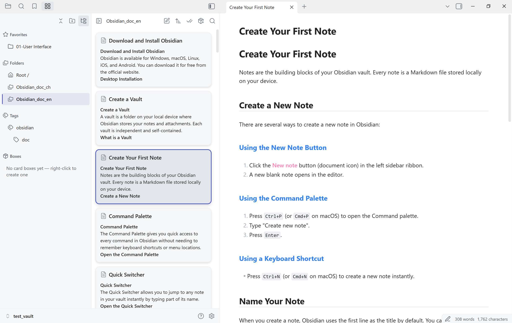

# Card Workspace

[简体中文](README.zh-CN.md)

An Obsidian plugin that shows folder notes as beautiful card stream in the sidebar or main editor leaf. Open Card Workspace manually, browse notes by folder, filter notes by tags, search notes by builtin function, and click a card to open it.



> ## What's new in 1.0.0
>
> **Dual-pane sidebar layout.** Card Workspace now renders its own navigation column next to the card stream, so folders, tags, card boxes, and favorites are one click away without borrowing Obsidian's File Explorer. Drag the divider to resize the navigation column, or use the toggle button in the header to hide it and give the cards the full width. When the sidebar gets too narrow for two columns, the layout automatically falls back to a single pane and the toggle button swaps between navigation and cards, so the panel stays usable at any width.
>
> **Card boxes.** A card box is a saved, topic-oriented collection that lives in the navigation pane's **Boxes** section. Right-click there to create one, or save your current folder-and-tag scope as a box in one step. Each box keeps its own membership rules (folder scope plus tags, combined with OR across rules), its own sort order, and its own pins, and you can add or exclude individual notes by hand. Use boxes to collect notes that belong together conceptually but live in different folders, without moving files or maintaining an index note.

## Table of contents

- [Why Card Workspace](#why-card-workspace)
- [Installation](#installation)
- [Quick start](#quick-start)
- [Features](#features)
- [Compatibility and limitations](#compatibility-and-limitations)
- [Privacy](#privacy)
- [Development](#development)
- [Releasing](#releasing)
- [Support and license](#support-and-license)

## Why Card Workspace

Card Workspace gives you a visual, scannable way to browse and organize the notes inside any folder. Instead of reading a plain file list, you see cards with titles and excerpts. Click a folder, glance at the cards, and open the note you want without losing your place.

## Installation

Card Workspace is installed manually from GitHub releases.

1. Download the latest release from the [Releases](https://github.com/kenanlian/obsidian-card-workspace/releases) page.
2. Extract the archive and copy `main.js`, `manifest.json`, and `styles.css` into your vault's `.obsidian/plugins/card-workspace/` folder.
3. Open Obsidian's **Settings -> Community plugins**.
4. Turn off **Safe mode** if it is on.
5. Find **Card Workspace** in the plugin list and enable it.

## Quick start

1. Run **Open Card Workspace view** from Obsidian's command palette, or click the ribbon icon, to open the panel in the **left sidebar**.
2. Pick a folder, tag, or card box in Card Workspace's own navigation pane.
3. Browse the cards and click one to open its note.
4. Right-click a folder, tag, box, or card to reach the rest of the actions, and drag a card into an open editor to insert a link to it.

## Features

- **Left-sidebar folder browsing.** Open Card Workspace in the left sidebar and browse a folder as a card stream.
- **Two-column navigation pane.** A resizable navigation column sits next to the card stream, so you can switch folders, tags, card boxes, and favorites without leaving the panel.
- **Card boxes.** Save a folder-and-tag scope as a reusable, rule-based collection with its own name and sort order, and add the current scope or view to a box in one step.
- **Favorites.** Keep frequently used folders, files, tags, and boxes in a dedicated Favorites section, grouped by kind and reorderable.
- **Context menus everywhere.** Right-click in the navigation pane or on a card to create notes, folders, canvases, and bases, rename, duplicate, move, delete, copy vault or system paths, reveal in the system file explorer, and search within a folder.
- **Drag to insert.** Drag a card into an open editor to insert a wikilink, an embed, the note's content, or its title plus content. The plugin can also ask which one to use on every drop.
- **Card previews.** Each card shows the note title and a Markdown-stripped excerpt.
- **Virtualized scrolling.** Large folders stay smooth because only visible cards are rendered.
- **Two-way sync.** Click a card to open its note. Switch notes in the editor and the corresponding card is selected automatically.
- **Local search.** Full-text search across the current folder's cards.
- **Tag filtering.** Filter cards by tags extracted from frontmatter and note content.
- **Pin reordering.** Pin cards to keep them at the top of the stream.
- **Bulk actions.** Select multiple cards to move, delete, or merge notes in batches.

## Compatibility and limitations

- **Desktop only.** Card Workspace relies on desktop left-sidebar workflows. It is unavailable on mobile.
- **Sidebar-first workflow.** Card Workspace is a left-sidebar view with its own navigation pane, opened from the ribbon icon or the command palette.
- **Obsidian version.** Requires Obsidian 1.9.0 or later, because card support for Bases depends on it. Behavior and compatibility follow what is declared in `manifest.json`.

## Privacy

All processing stays inside your vault. The plugin does not make external network requests. File operations go through Obsidian's local Vault and FileManager APIs. Search indexing uses the local `minisearch` library.

## Development

```bash
npm install
npm run build
```

For watch mode:

```bash
npm run dev
```

Run type checks and tests:

```bash
npm run check
npm test
```

## Releasing

This repo creates draft GitHub Releases from bare semver tags through `.github/workflows/release.yml`.

1. Determine the target version from `manifest.json`:

   ```bash
   TAG=$(node -p "require('./manifest.json').version")
   ```

2. Sync the release metadata:

   ```bash
   npm run release:prepare -- "$TAG"
   ```

   To also raise the minimum supported Obsidian version, pass it as the second argument:

   ```bash
   npm run release:prepare -- "$TAG" 1.9.0
   ```

3. Run the normal checks plus release validation:

   ```bash
   npm run check:svelte
   npm run check
   npm run build
   npm test
   npm run release:check -- "$TAG"
   ```

4. Commit the version bump, then create and push an annotated bare semver tag that exactly matches `manifest.json.version` (for example `<version>`, not `v<version>`):

   ```bash
   git tag -a "$TAG" -m "$TAG"
   git push origin main
   git push origin "$TAG"
   ```

5. The workflow creates a draft GitHub Release containing `main.js`, `manifest.json`, and `styles.css`.
6. Add release notes on GitHub and publish the draft release.

## Support and license

If you run into issues, please open a ticket on [GitHub Issues](https://github.com/kenanlian/obsidian-card-workspace/issues).

Card Workspace is released under the MIT License.
