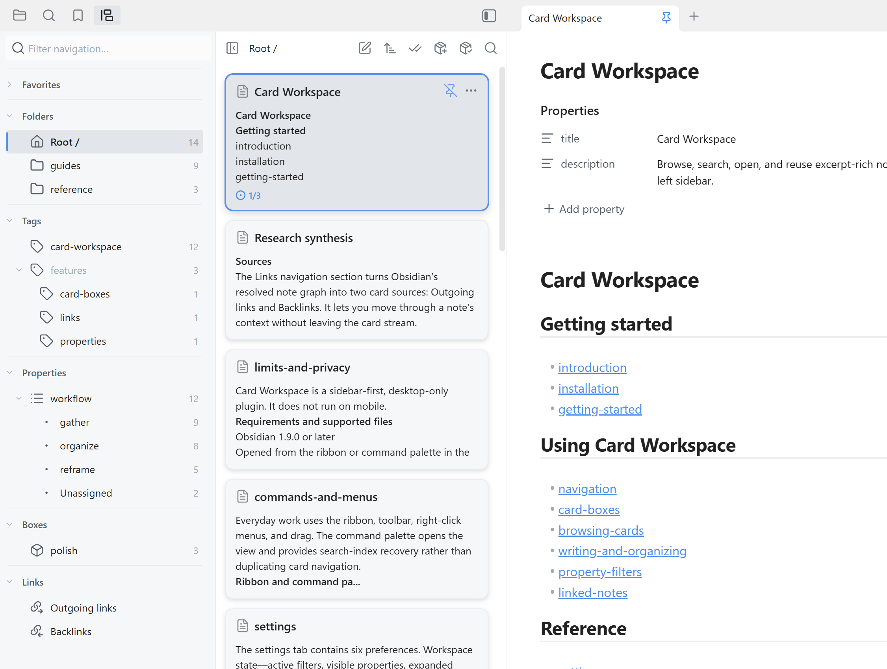

# Card Workspace

[English](README.md)

Card Workspace 是一款运行在**左侧边栏**的 [Obsidian](https://obsidian.md/) 插件。它把文件夹、标签、属性、出链、反链与卡片盒汇集成编辑器旁一条可读的卡片流。找到上下文，整理成视角，再把有用的内容带回正在写的笔记。

每张 Markdown 卡片都有标题和去除格式后的摘要，不必把一组笔记压缩成一串文件名。它不是 Obsidian Canvas，拖动卡片也不会改变仓库结构。点击卡片会打开笔记；Markdown 和其他受支持的文件仍留在原来的文件夹。

使用文档：[card-workspace](https://kenanlian.github.io/card-workspace/zh/)。



## 目录

- [为什么选择 Card Workspace](#为什么选择-card-workspace)
- [安装](#安装)
- [快速开始](#快速开始)
- [功能特性](#功能特性)
- [兼容性与限制](#兼容性与限制)
- [隐私](#隐私)
- [开发](#开发)
- [发布](#发布)
- [支持与许可证](#支持与许可证)

## 为什么选择 Card Workspace

Card Workspace 适合一边写作、一边扫读和收集笔记的人：研究主题、长期项目、阅读清单，以及任何跨越文件夹的工作。它提供直接操作，不引入另一套查询语言。

- **汇集** — 浏览文件夹，按需包含子文件夹，再用标签和 frontmatter 属性收窄卡片流；也可以沿笔记的出链和反链寻找。
- **整理** — 排序、分组、置顶，再把有用的视角保存成卡片盒。
- **重构** — 在编辑器旁打开上下文，或把 Markdown 卡片拖入正在写的笔记。

## 安装

Card Workspace 可以从 Obsidian 第三方插件市场安装，也可以从 GitHub Releases 手动安装某个特定版本。

### 从插件市场安装

1. 打开 Obsidian 的 **设置 → 第三方插件**。
2. 如已开启安全模式，请先关闭。
3. 点击 **浏览**，搜索 **Card Workspace**。
4. 依次点击 **安装** 和 **启用**。

插件的[市场页面](https://community.obsidian.md/plugins/card-workspace)也可以把安装操作交回 Obsidian。

### 从 GitHub Releases 安装

需要使用当前市场版本以外的版本时，采用这种方式。

1. 从 [Releases](https://github.com/kenanlian/obsidian-card-workspace/releases) 页面下载对应版本。
2. 解压 `main.js`、`manifest.json` 和 `styles.css`，复制到仓库目录 `.obsidian/plugins/card-workspace/` 中。
3. 打开 **设置 → 第三方插件**。
4. 如有需要，关闭安全模式。
5. 在已安装插件列表中启用 **Card Workspace**。

## 快速开始

1. 点击 ribbon 图标，或从命令面板运行 **打开 Card Workspace 视图**。面板会在**左侧边栏**打开。
2. 在导航栏中选择一个文件夹，再用标签或属性值继续收窄；也可以把来源切换到卡片盒，或从正在阅读的笔记进入它的出链或反链。
3. 浏览卡片流；用搜索、排序、分组或置顶整理视角，再点击卡片打开笔记。
4. 右键导航条目或卡片可使用更多操作。把 Markdown 卡片拖入已打开的编辑器，可以插入链接或内容。

Card Workspace 会恢复上次浏览的**文件夹**；如果是库根目录，则恢复整个仓库。它不会重新打开上次的卡片盒或双链来源。

## 功能特性

- **导航栏。** 卡片流旁边是一栏宽度可调的导航栏，文件夹、标签、属性、卡片盒和收藏都只需一次点击。可以拖动分隔条调整宽度，或把导航栏收起来，让卡片占满整个宽度。当侧边栏宽度不足以容纳两栏时，布局会自动降为单栏，标题栏的切换按钮会在导航栏和卡片流之间切换。
- **隐藏导航条目。** 右键文件夹、标签或分区标题可隐藏条目。在 **设置 → Card Workspace → 导航** 中恢复分区，或管理全库隐藏的文件夹和标签。隐藏仅影响导航展示，卡片、搜索、筛选和已有收藏仍可使用。详见[导航隐藏说明](docs/navigation-visibility.md)。
- **文件夹浏览。** 选择一个文件夹，按需包含子文件夹，再用标签和 frontmatter 属性收窄卡片流。这些浏览筛选只作用于文件夹来源；进入卡片盒或双链视图时会暂停，并显示筛选已暂停的提示，回到文件夹后自动恢复。
- **卡片盒。** 把当前的文件夹、标签和属性视角连同分组配置保存成可复用的集合，它会持续收集符合规则的笔记。也可以手动加入或排除单篇笔记，并为每个盒子保留独立的排序、分组和置顶。在卡片盒配置窗口中可调整分组依据、属性字段、组排序依据和方向。源文件仍留在原处。双链视图可以保存为固定快照。
- **双链。** 围绕当前笔记切换出链与反链。可以跟随编辑器，也可以固定来源后继续查看其他笔记。 出链、反链默认按引用次数从多到少排序，并分别记住排序方式。每个文件保留一张卡片，徽标显示当前笔记与该文件之间的引用次数；反链默认显示 3 个引用上下文，可在设置中选择 1、2、3 或全部，并在卡片内展开其余片段。同段重复引用合并展示，次数仍按实际引用统计。出链和反链沿用普通卡片的正文渲染。出链的标题或块链接显示目标位置的内容，普通链接显示目标笔记的开头部分，并使用普通预览的行数设置；反链显示源笔记中的引用上下文。相同目标位置的重复引用合并展示。点击片段定位它展示的源引用处或目标位置。
- **本地全文搜索。** 在当前文件夹、卡片盒、出链或反链中搜索，支持连续中文和中英文混合查询。Markdown 卡片按原文顺序显示高亮命中片段，每段占两行，可通过独立设置选择每张卡片最多显示 1–5 段（默认 2 段），不受普通预览行数限制；重叠上下文合并，较短的命中行补充后续连续正文。点击片段或按 Enter/空格可定位命中，并保留笔记的编辑或阅读模式。命中数徽标仍保留，仅标题命中时高亮标题并保留普通开头预览；清空搜索恢复普通预览。
- **整理卡片流。** 按编辑时间、创建时间或文件名排序，并对卡片分组。置顶让需要的笔记留在顶部；置顶只重排已经符合当前筛选和搜索的卡片。
- **拖入编辑器。** 把 Markdown 卡片拖到光标处，可插入 wikilink、嵌入、正文，或「标题 + 正文」。既可以每次选择，也可以设置默认方式。在行为设置中打开默认关闭的「启用章节拖拽插入」，即可选择标题章节或整篇笔记。章节内容包含下级标题，截止到下一个同级或更高级标题；复制保留原始 Markdown 格式。
- **卡片图片预览。** 从 1.3.4 起，默认使用右侧缩略图并裁切铺满。可在插件设置中切换为标题下方内联图片、选择完整显示，或关闭图片预览。正文中的本地 PNG、JPEG、WebP、BMP 图片在浏览区域附近按需加载，缩略图跨重启缓存。详见[图片预览说明](docs/card-images.md)。
- **批量操作。** 点击选择单张卡片，Shift+点击连续选择，或全选当前视角。随后可移动笔记、添加或移除标签、加入或移出卡片盒、通过实时预览合并 Markdown 笔记，或删除所选内容。
- **文件夹拖放。** 在“文件夹”分区内，拖到目标行中间一半可移入该目录；拖到上、下各四分之一可排在目标前、后，仅允许同级排序。松手后直接执行。悬停 600ms 会临时展开折叠目标，靠近滚动边缘会自动滚动。根目录固定首位，只接受移入。首次有效排序后，该组兄弟目录保存独立手动顺序，新建或移入的目录追加到末尾。文件夹右键菜单在独立分组中提供子文件夹名称排序（A → Z、Z → A）和手动排序，仅排序该文件夹的直接子文件夹，顶层排序入口也位于“文件夹”分区和根目录的右键菜单。A → Z 清除该层手动顺序，恢复默认名称排序；Z → A 保存当前倒序，之后新增目录仍追加到末尾。菜单勾选当前排序模式，选择手动排序会保留当前顺序，完成有效的拖拽排序后自动勾选手动排序。同名冲突不会合并或覆盖。文件夹与收藏拖放各自在自己的分区内生效。
- **标签和属性导航排序。** 右键“标签”或“属性”分区，可选择名称升序、名称降序或手动排序；父标签菜单排序直接子标签，属性名菜单排序该属性的值。同级条目拖到目标行上半或下半，可放在其前或后，并自动切换为手动排序。拖拽只改变显示顺序，支持边缘自动滚动。顺序在所有视图间共享，重启后保留。新增条目在名称模式下自动参与排序，在手动模式下追加到末尾；暂时消失的属性值保留原来的手动位置。“未分配”固定末尾，不参与拖拽。通过插件重命名标签时，会同步更新排序记录。
- **收藏。** 可把常用的文件夹、文件、标签和卡片盒放进同一区域，不同类型可混排，顺序由拖拽决定。
- **右键菜单。** 在导航栏或卡片上右键即可新建笔记、文件夹、白板和 Base，重命名、复制、移动、删除，复制仓库路径或系统路径，在系统文件管理器中定位，以及在指定文件夹内搜索。确认后重命名或删除标签时，会同步更新笔记、当前筛选、收藏和卡片盒规则。
- **按习惯预览或打开。** 可以悬停预览笔记，也可以在当前标签页、新标签页、分栏或新窗口中打开。启用核心插件“页面预览”后，可在本插件的“外观”设置中调整卡片悬浮预览的宽高（默认 600 × 400 像素），弹窗会随窗口大小收缩。点击卡片打开笔记；在编辑器中切换笔记时，对应卡片也会被选中。
- **虚拟化滚动。** 只渲染当前可见的卡片，大型来源依然可以扫读。

## 兼容性与限制

- **仅支持桌面端。** Card Workspace 不在移动端运行。
- **左侧边栏。** 从 ribbon 图标或命令面板打开。
- **Obsidian 版本要求。** 需要 Obsidian 1.11.4 或更高版本。1.13 及以上使用原生确认弹窗、声明式设置并接入设置搜索；1.11.4–1.12 使用兼容弹窗和共用定义的旧版设置渲染入口。实际行为和兼容性以 `manifest.json` 为准。更早的 Obsidian 版本会继续收到最后一个兼容的发行版（1.3.4）。
- **受支持的文件。** Markdown（`.md`）卡片有完整预览和全文索引。Bases（`.base`）、Canvas（`.canvas`）和 Excalidraw（`.excalidraw` 与 `.excalidraw.md`）使用标题和占位内容，只按标题搜索。

## 隐私

所有处理都在你的本地仓库内完成。该插件不会发起外部网络请求。文件操作通过 Obsidian 本地的 Vault 和 FileManager API 完成。随插件打包的搜索引擎把本地索引存在 IndexedDB 中。笔记仍留在原有文件夹。

## 开发

```bash
npm install
npm run build
```

如需启用 watch 模式：

```bash
npm run dev
```

运行类型检查和测试：

```bash
npm run check
npm test
```

## 发布

此仓库通过 `.github/workflows/release.yml`，基于纯 semver 标签自动创建 GitHub Release。

1. 从 `manifest.json` 中确定目标版本：

   ```bash
   TAG=$(node -p "require('./manifest.json').version")
   ```

2. 同步发布元数据：

   ```bash
   npm run release:prepare -- "$TAG"
   ```

   如果还需要同时调整最低支持的 Obsidian 版本，可将它作为第二个参数传入：

   ```bash
   npm run release:prepare -- "$TAG" 1.11.4
   ```

3. 运行常规检查以及发布校验：

   ```bash
   npm run check:svelte
   npm run check
   npm run build
   npm test
   npm run release:check -- "$TAG"
   ```

4. 提交版本变更，然后创建并推送一个带注释的纯 semver 标签，该标签必须与 `manifest.json.version` 完全一致（例如 `<version>`，而不是 `v<version>`）：

   ```bash
   git tag -a "$TAG" -m "$TAG"
   git push origin main
   git push origin "$TAG"
   ```

5. 工作流会创建一个包含 `main.js`、`manifest.json`、`styles.css`、`LICENSE` 和 `THIRD_PARTY_NOTICES` 的 GitHub Release。发布说明会附上对应版本的源码归档和构建说明链接。
6. 在 GitHub 上检查并补充发布说明。

## 支持与许可证

如果你遇到问题，请前往 [GitHub Issues](https://github.com/kenanlian/obsidian-card-workspace/issues) 提交 issue。

Copyright (c) 2026 kenanlian.

除另有声明外，Card Workspace 本次修订及后续版本中由项目拥有版权的文件采用 **GNU General Public License 第 3 版，仅限该版本**（`GPL-3.0-only`）。完整条款见 [LICENSE](LICENSE)。你可以按该协议重新分发和修改软件；软件不提供任何担保，包括适销性或特定用途适用性的默示担保。

此前已经发布的 **1.4.2 及更早版本**继续适用其发布时的 MIT License，参见 [1.4.2 的许可证](https://github.com/kenanlian/obsidian-card-workspace/blob/1.4.2/LICENSE)。本次变更不撤销此前授予的权限。

打包的第三方库保留各自原有的许可证和版权声明，见 [THIRD_PARTY_NOTICES](THIRD_PARTY_NOTICES)。每个 Release 都提供对应版本的源码归档；构建说明见[开发](#开发)。
